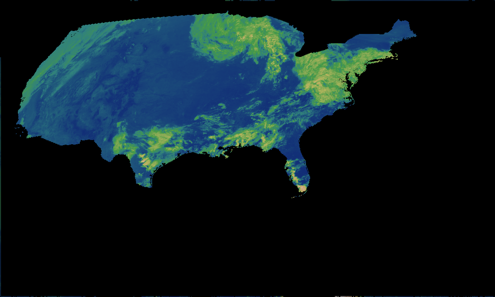
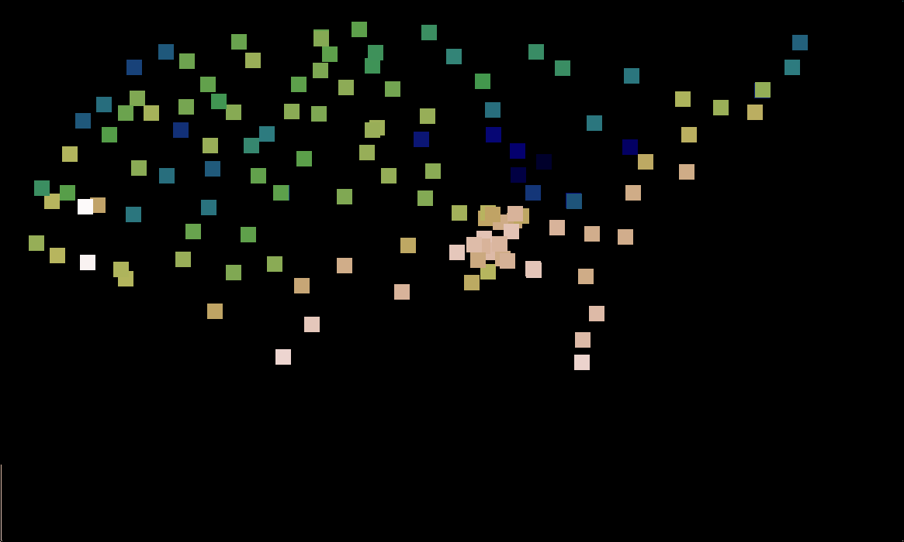
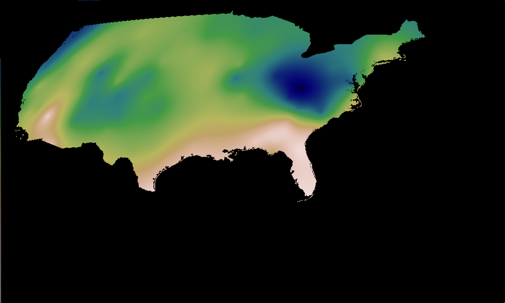

# Hyperspectral Satellite Image Translation
## Overview
The goal of this project is to use deep image processing techniques to model weather conditions from hyperspectral satellite imagery. 
## Data
Input data consists of sixteen-channel hypersepectral readings from the Geostationary Operational Environmental Satellite (GOES) R-series Advanced Baseline Imager (ABI), sampled in five-minute increments. Ground truth data consists of images composed of readings from NOAA's U.S. Climate Reasearch Network (USCRN), a collection of 144 climate observing stations across the U.S. 
### Data Collection and Preprocessing
To Do: Organize input and groud truth rasters together for a given time.
#### GOES ABI
Many tools are available to retreieve the GOES ABI data, which is available on public cloud storage. For now I am using [Goes2Go](https://github.com/blaylockbk/goes2go) as it is very simple to use, but I may need to write my own for my desired functionality. Images are stored in NetCDF format which contains many metadata such as the satellites position, angle of scan for each pixel, and more. 

The first step is to downsample the image. 

Next, the pixel's coordinates are calculated from their scan angles using the algorithim found [here](https://www.star.nesdis.noaa.gov/atmospheric-composition-training/python_abi_lat_lon.php). 

The image is masked to include only the contigous U.S.

To Do: 

Crop image

Stack each band depth-wise
#### CRN
Data is downloaded from the sub-hourly [USCRN Quality-controlled datasets](https://www.ncei.noaa.gov/access/crn/qcdatasets.html) directory. Each file is a list of readings for a single station over time. 

First, all station files are concatenated. 

Readings are then grouped by the date and time when they occured. (One file per five-minute interval with every station's reading at that time)

Using a copy of a georefernced GOES ABI image, all station readings for a given time are rasterized.

A reading is interpolated over the entire raster using a [radial basis function with a linear kernel.](https://docs.scipy.org/doc/scipy/reference/generated/scipy.interpolate.RBFInterpolator.html)

## Model Selection
To Do: Select model

